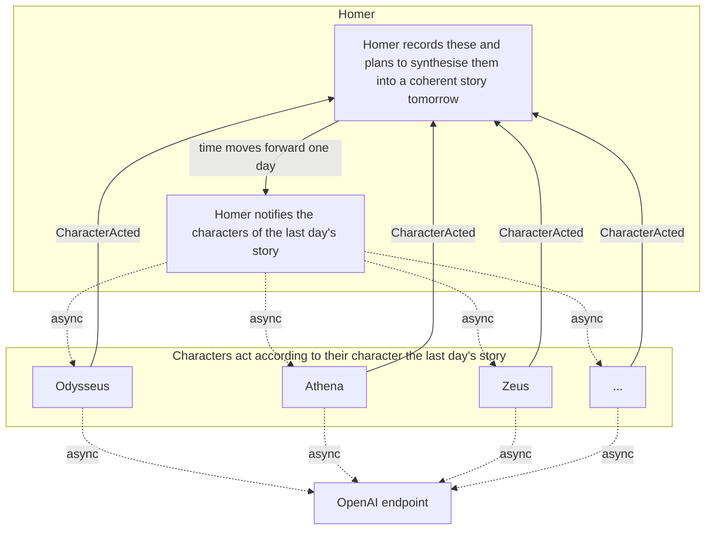

## Overview

Let's try to use LLMs to simulate the story of the Odyssey being retold, but with a slight difference:
> Odysseus has a knowledge of and can use modern technology

Using LLM API's and calling them asynchronously is a useful demonstration of the type of [IO-Bound](../guides/performance.md#io-bound) workloads which Hades is designed around.
This will also illustrate some interesting features of the event loop.

## Designing the processes

The processes and how they interact is the key to this simulation. The key idea is that we have a bit of a loop, which is enabled by the [hades event loop](../api_reference/hades.md#event-loop):



## Implementation

### Processes

The core logic is within the processes 

```python
--8<-- "examples/multi_agent_llm_storytelling/processes.py"
```
### Additional Code

??? "Event Definitions"
    ```python
    --8<-- "examples/multi_agent_llm_storytelling/events.py"
    ```

??? "LLM Prompts"
    ```
        --8<-- "examples/multi_agent_llm_storytelling/prompts.py"
    ```
??? "Utilities"
    ```python
    --8<-- "examples/multi_agent_llm_storytelling/utilities.py"
    ```

### Putting it all together

```python
--8<-- "examples/multi_agent_llm_storytelling/simulation.py"
```


## The resulting story


--8<-- "examples/multi_agent_llm_storytelling/output.txt"

